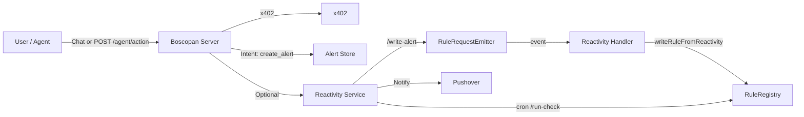

# Boscopan

**Autonomous AI agents + on-chain price alerts.** Natural language, x402 micropayments, Somnia reactivity, and Somnia testnet

---

## why Boscopan

Boscopan fits **agentic automation + onchain** and **AI × Web3** tracks:

- **AI agent as the interface** — Users (or other agents) talk in plain language: *"Alert me when ETH > 4000"*, *"List my alerts"*, *"Run my alerts check now"*. No RPC, ABI, or wallet UX in the conversation.
- **Agent-initiated CRE execution** — A scheduled job reasons over alerts + prices with an LLM and stores a summary. You can also trigger the same “alerts check” on demand from chat or via `POST /agent/run-alerts-check`, optionally calling your deployed CRE workflow (prices + RuleRegistry + Pushover).
- **Single agent API** — One `POST /agent/action` with `intent` + `params`. The server handles chain, CRE, and x402. For paid actions (e.g. create alert), the server returns 402; the agent pays then retries. Perfect for AI agents that need a “blockchain lite” API.
- **x402 micropayments** — Create-alert is gated by $0.01 STT (Somnia testnet). Demonstrates payment-protected APIs and agentic payments.
- **On-chain + Somnia reactivity** — Rules are written to RuleRegistry via Somnia on-chain reactivity (RuleRequestEmitter → handler → writeRuleFromReactivity). The reactivity service provides off-chain subscriptions (filtered + wildcard), cron, and HTTP /run-check and /write-alert.

---

## What’s built

| Area | Implementation |
|------|----------------|
| **Chat** | Natural language over `/chat`: create one or more alerts, list alerts, cancel by id or index, get current price (BTC/ETH/LINK), **run alerts check now**. Uses OpenAI (e.g. `gpt-4o-mini`) with tool calling. |
| **Agent API** | `POST /agent/action` with intents: `create_alert`, `list_alerts`, `get_price`, `cancel_alert`, `run_alerts_check`. 402 for paid intents with `agentAction.forwardTo`; optional `X-Agent-Wallet` for list/cancel. [OpenAPI](docs/agent-api.openapi.yaml) \| [Tool schema](docs/agent-tools.schema.json). |
| **Scheduled agent** | Optional periodic job (`SCHEDULED_AGENT_INTERVAL_MS`): reads all alerts + current prices, calls LLM for a short summary/suggestion, stores last result. `GET /agent/summary` returns last summary and timestamp. |
| **Run alerts check** | Server-side “which alerts would trigger now?” plus optional CRE run: `POST /agent/run-alerts-check` or intent `run_alerts_check` (and from chat). If `CRE_RUN_CHECK_URL` is set, server also POSTs to that URL to trigger full CRE (Chainlink prices + RuleRegistry + Pushover). |
| **x402** | Create-alert protected by x402 ($0.01 STT). 402 challenge → agent pays → server validates and creates alert. |
| **CRE workflow** | HTTP trigger (write alert to RuleRegistry), Cron trigger (prices + conditions + Pushover), **Run-check HTTP trigger** (same logic as cron, for on-demand runs). |
| **Backend state** | In-memory alert store by payer; cancel by `alertId` or 1-based index. Price service (e.g. CoinGecko, cached). |
| **Contract & deploy** | `RuleRegistry.sol` on Base Sepolia; Hardhat deploy script: `npm run deploy:rule-registry`. |

---

## Somnia reactivity usage

| What | Code |
|------|------|
| **Reactivity service** (cron, /run-check, /write-alert, subscriptions) | [reactivity/src/main.ts](reactivity/src/main.ts) |
| **Run-check** (read RuleRegistry, prices, Pushover) | [reactivity/src/runCheck.ts](reactivity/src/runCheck.ts) |
| **Off-chain subscriptions** (filtered + wildcard) | [reactivity/src/subscriptions.ts](reactivity/src/subscriptions.ts) |
| **Write rule on-chain** (RuleRequestEmitter.requestRule) | [reactivity/src/writeOnChain.ts](reactivity/src/writeOnChain.ts) |
| **RuleRegistry** (Somnia reactivity only; no CRE) | [contracts/RuleRegistry.sol](contracts/RuleRegistry.sol) |

---

## Architecture (high level)



- **User/Agent** → Boscopan server (chat or agent API).
- **Server** → x402 for create-alert; optional POST to reactivity `/write-alert` and `/run-check`.
- **Reactivity** → Cron + HTTP /run-check (read RuleRegistry, prices, Pushover); /write-alert → RuleRequestEmitter → on-chain handler → RuleRegistry.

---

## Quick start

1. **Env**  
   Copy `.env.example` to `.env`. Set at least: `OPENAI_API_KEY`, `X402_RECEIVER_ADDRESS`, `AGENT_WALLET_PRIVATE_KEY`. Optional: `SCHEDULED_AGENT_INTERVAL_MS`, `REACTIVITY_RUN_CHECK_URL`, Pushover for reactivity.

2. **Contract**  
   Deploy RuleRegistry (see [Deploy RuleRegistry](#0-deploy-rulegistry-on-somnia-testnet)) then deploy reactivity; set `X402_RECEIVER_ADDRESS` and `RULE_REQUEST_EMITTER_ADDRESS`.

3. **Run server (with chat)**  
   `npm run dev:server` → Boscopan at `http://localhost:3000` with interactive chat.

4. **Try it**  
   In chat: *"Create an alert when BTC is greater than 60000"* (payment flow); *"List my alerts"*; *"What’s the current ETH price?"*; *"Run my alerts check now"*.

5. **CRE**  
   Use CRE CLI to simulate HTTP trigger (write alert on-chain) and Cron (or run-check) for prices and notifications. Set `CRE_RUN_CHECK_URL` to your deployed run-check URL to have “run alerts check” trigger full CRE.

---

## Setup guide

### Prerequisites

- **Node.js** v18+, **Git**
- **OpenAI API key** (used instead of Gemini)
- **Pushover** account + app (user key + API token) for notifications
- **Wallet** with STT on Somnia testnet (for deploy and x402)

### 0. Deploy RuleRegistry on Somnia testnet

Deploy `contracts/RuleRegistry.sol`. Constructor: STT token address only (set `STT_TOKEN_ADDRESS` in `.env`). RPC: `https://dream-rpc.somnia.network/`, chain ID: 50312.

**Using Hardhat (recommended):**

```bash
npm run compile
npm run deploy:rule-registry
npm run deploy:reactivity
```

Set `X402_RECEIVER_ADDRESS` to the deployed RuleRegistry. Then run `deploy:reactivity` to deploy RuleRegistryReactivityHandler and RuleRequestEmitter and set the handler on RuleRegistry. Set `RULE_REQUEST_EMITTER_ADDRESS` in `.env` for the reactivity service.

Alternatively use [Remix](https://remix.ethereum.org/) with constructor `(STT_TOKEN_ADDRESS)`.

### 1. Clone and install

```bash
git clone <your-repo-url>
cd boscopan
npm install
```

### 2. Configure environment

```bash
cp .env.example .env
```

Edit `.env`:

- **Server:** `PORT`, `X402_RECEIVER_ADDRESS`, `X402_FACILITATOR_URL`, `OPENAI_API_KEY`, `AGENT_WALLET_PRIVATE_KEY`
- **Optional:** `SCHEDULED_AGENT_INTERVAL_MS` (e.g. `900000` for 15 min), `REACTIVITY_RUN_CHECK_URL`
- **Reactivity:** `RULE_REGISTRY_ADDRESS` or `X402_RECEIVER_ADDRESS`, `PUSHOVER_USER_KEY_VAR`, `PUSHOVER_API_KEY_VAR`; optional `RULE_REQUEST_EMITTER_ADDRESS`, `REACTIVITY_WRITER_PRIVATE_KEY`
- **Somnia deploy:** `RPC_URL`, `STT_TOKEN_ADDRESS`

### 3. Configure reactivity service

For the reactivity service: set `RULE_REGISTRY_ADDRESS` (or `X402_RECEIVER_ADDRESS`), `RULE_REQUEST_EMITTER_ADDRESS` (from deploy:reactivity), and Pushover keys. Prices use CoinGecko (no chain-specific feeds).

---

## Execution

### Start Boscopan (with chat)

```bash
npm run dev:server
```

You should see **Boscopan — Server ready** and the list of routes (e.g. `POST /agent/action`, `POST /chat`, `GET /agent/summary`, `POST /agent/run-alerts-check`). Interactive chat is enabled; type messages and press Enter.

### Create alert (natural language)

In chat:

```text
> Create an alert when BTC is greater than 60000
```

Server uses OpenAI to extract params, then creates a paid alert via x402 and returns alert details; optional POST to reactivity `/write-alert` to persist on-chain.

### List / cancel / price / run check (chat)

- *"List my alerts"* / *"Show my alerts"*
- *"Cancel the second alert"* / *"Cancel alert by id ..."*
- *"What’s the current ETH price?"*
- *"Run my alerts check now"*

### Agent API (curl)

```bash
# List alerts (use X-Agent-Wallet or params.payer)
curl -X POST http://localhost:3000/agent/action \
  -H "Content-Type: application/json" \
  -H "X-Agent-Wallet: 0xYourAddress" \
  -d '{"intent":"list_alerts"}'

# Get price
curl -X POST http://localhost:3000/agent/action \
  -H "Content-Type: application/json" \
  -d '{"intent":"get_price","params":{"asset":"ETH"}}'

# Run alerts check
curl -X POST http://localhost:3000/agent/run-alerts-check
curl -X POST http://localhost:3000/agent/action -H "Content-Type: application/json" -d '{"intent":"run_alerts_check"}'

# Last scheduled summary
curl http://localhost:3000/agent/summary
```

### Create alert via API (x402)

Direct create (payment required):

```bash
curl -X POST http://localhost:3000/alerts \
  -H "Content-Type: application/json" \
  -d '{"asset":"BTC","condition":"gt","targetPriceUsd":60000}'
```

First call returns `402` with payment challenge; client pays then retries with `x-payment` header (e.g. using `x402-fetch` or equivalent).

### Reactivity: write alert on-chain and run cron

1. Start the reactivity service: `npm run dev:reactivity` (uses `RULE_REGISTRY_ADDRESS`, `RULE_REQUEST_EMITTER_ADDRESS`, Pushover keys).
2. When you create an alert (after x402), the server can POST the payload to `{REACTIVITY_RUN_CHECK_URL}/write-alert` to write the rule on-chain via RuleRequestEmitter (if `REACTIVITY_RUN_CHECK_URL` and writer key are set).
3. Cron runs periodically (configurable via `REACTIVITY_CRON_INTERVAL_MS`); or call `POST {REACTIVITY_RUN_CHECK_URL}/run-check` for on-demand run.

Set `REACTIVITY_RUN_CHECK_URL` in `.env` (e.g. `http://localhost:3001`) so `POST /agent/run-alerts-check` and the `run_alerts_check` intent also trigger the reactivity run-check.

---

## API summary

| Method | Path | Description |
|--------|------|-------------|
| POST | `/chat` | Natural language; create/list/cancel alerts, get price, run alerts check. |
| POST | `/agent/action` | Agent API: `intent` + `params`; 402 for paid intents. |
| GET | `/agent/summary` | Last scheduled agent summary (alerts + prices, LLM). |
| POST | `/agent/run-alerts-check` | Run alerts check now; optionally calls reactivity `/run-check` if `REACTIVITY_RUN_CHECK_URL` set. |
| GET | `/alerts` | List alerts by `?payer=`. |
| GET | `/prices` | Current BTC/ETH/LINK USD (optional `?asset=`). |
| POST | `/alerts` | Create alert (x402 $0.01 STT). |
| POST | `/alerts/cancel` | Cancel by `alertId` or `alertIndex` (body: `payer`, `alertId` or `alertIndex`). |

Full spec: [docs/agent-api.openapi.yaml](docs/agent-api.openapi.yaml). Tool schema for agents: [docs/agent-tools.schema.json](docs/agent-tools.schema.json).

---

## Directory structure

| Path | Purpose |
|------|--------|
| `server/` | Boscopan API: Express, chat, agent action, x402, alert store, price service, scheduled agent. |
| `server/src/server.ts` | Routes: `/chat`, `/agent/action`, `/agent/summary`, `/agent/run-alerts-check`, `/alerts`, `/prices`, `/alerts/cancel`. |
| `server/src/scheduledAgent.ts` | Periodic reasoning (alerts + prices → LLM summary), `runAlertsCheckNow()`. |
| `server/src/chat.ts` | Interactive terminal chat for Boscopan. |
| `server/src/alertStore.ts` | In-memory alerts by payer; cancel by id or index. |
| `server/src/priceService.ts` | Current prices (e.g. CoinGecko), cached. |
| `server/src/x402Client.ts` | x402 payment client for paid alert creation. |
| `reactivity/` | Somnia reactivity service: cron, /run-check, /write-alert, off-chain subscriptions (filtered + wildcard). |
| `contracts/RuleRegistry.sol` | On-chain rule storage; Somnia reactivity only (writeRuleFromReactivity). |
| `contracts/RuleRegistryReactivityHandler.sol` | Somnia reactivity handler; forwards events to RuleRegistry. |
| `contracts/RuleRequestEmitter.sol` | Emits RuleRequested for reactivity-driven rule writes. |
| `scripts/deploy-RuleRegistry.ts` | Hardhat deploy for RuleRegistry on Somnia testnet. |
| `scripts/deploy-reactivity.ts` | Deploy reactivity handler + emitter and set handler on RuleRegistry. |
| `docs/agent-api.openapi.yaml` | OpenAPI for Boscopan agent API. |
| `docs/agent-tools.schema.json` | JSON schema for agent intents/params. |

---

## Tech stack

- **Server:** Node.js, Express, OpenAI API (e.g. gpt-4o-mini), x402-express, x402-fetch, viem.
- **Reactivity:** @somnia-chain/reactivity SDK, cron (local), /run-check, /write-alert, off-chain subscriptions; CoinGecko prices, Pushover.
- **Chain:** Somnia testnet; RuleRegistry (Solidity), STT, Hardhat deploy.
- **Somnia Reactivity:** Optional event-driven rule writes via RuleRegistryReactivityHandler.

---

## Somnia Reactivity (optional)

Rules can be written on-chain via [Somnia reactivity](https://docs.somnia.network/developer/reactivity/tutorials/solidity-on-chain-reactivity-tutorial): when a subscribed event is emitted, the chain invokes the handler, which calls `RuleRegistry.writeRuleFromReactivity(data)`.

1. **Deploy** (after RuleRegistry is deployed):
   ```bash
   # Set RULE_REGISTRY_ADDRESS or X402_RECEIVER_ADDRESS in .env
   npm run deploy:reactivity
   ```
   This deploys `RuleRegistryReactivityHandler`, `RuleRequestEmitter`, and sets the handler on RuleRegistry.

2. **Create a subscription** (owner must hold ≥32 SOM for gas). Use [@somnia-chain/reactivity](https://www.npmjs.com/package/@somnia-chain/reactivity) SDK or the precompile at `0x0100`:
   - `handlerContractAddress`: deployed handler address
   - `emitter`: deployed `RuleRequestEmitter` address (filter by `RuleRequested(bytes32,string,string,uint256,uint256)`)

3. **Add rules via events**: Call `RuleRequestEmitter.requestRule(id, asset, condition, targetPriceUsd, createdAt)`; when the event fires, the handler writes the rule to RuleRegistry.

---

## Supported features

- **Assets:** BTC, ETH, LINK.
- **Conditions:** `gt`, `lt`, `gte`, `lte`.
- **Payment:** $0.01 STT per alert creation (x402).
- **Storage:** In-memory alert store + on-chain RuleRegistry via Somnia reactivity.
- **Notifications:** Pushover when reactivity cron (or /run-check) detects condition met.
- **Scheduled agent:** Optional interval; `GET /agent/summary` for last LLM summary.

---

## Reference

- **LinkLab / Book:** [smartcontractkit.github.io/x402-cre-price-alerts](https://smartcontractkit.github.io/x402-cre-price-alerts/)
- **x402:** [x402.org](https://x402.org/)
- **Somnia Reactivity:** [docs.somnia.network/developer/reactivity](https://docs.somnia.network/developer/reactivity)
